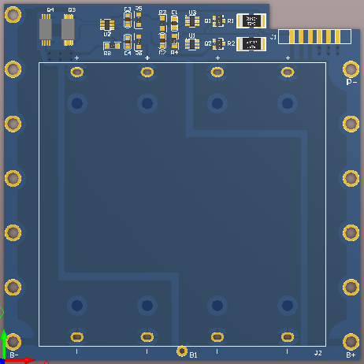
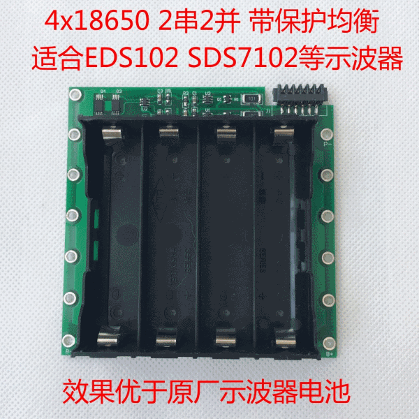
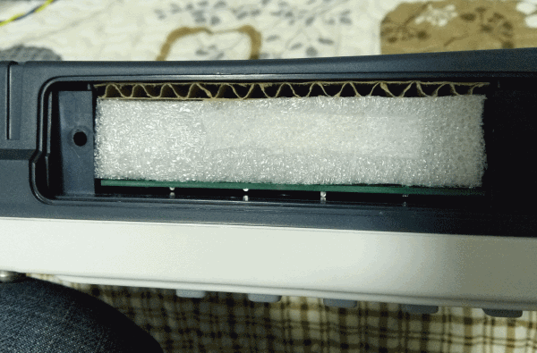
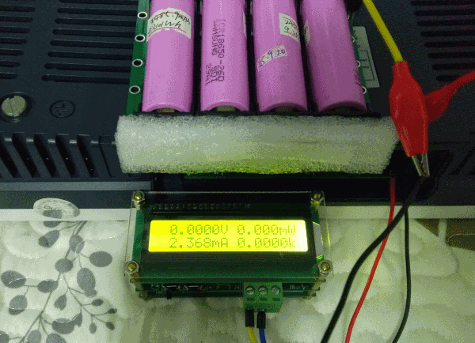
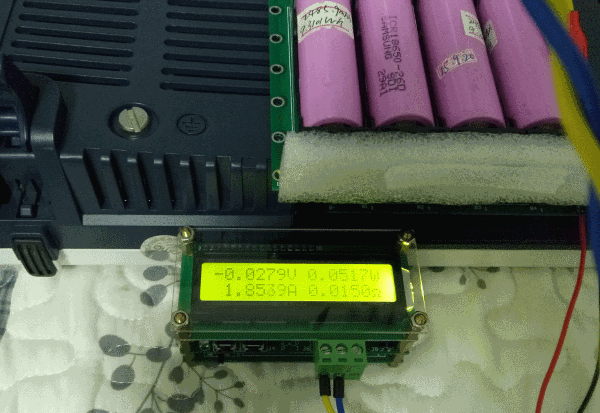
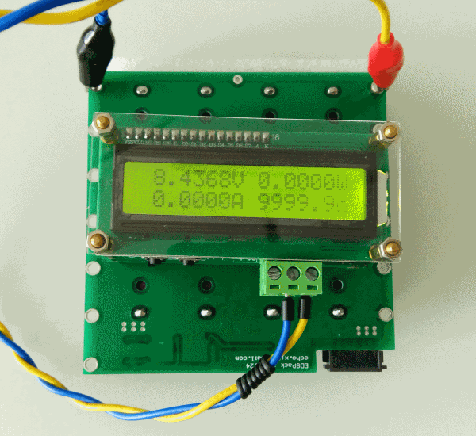
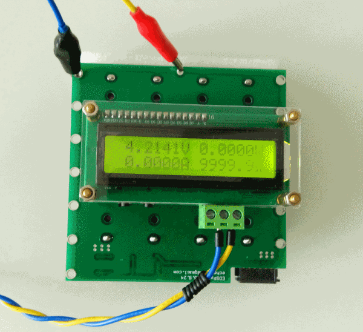
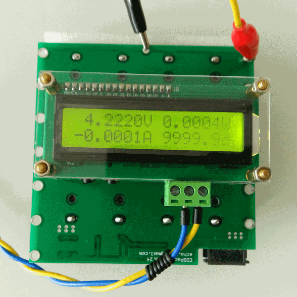

# EDSPack User Manual

EDSPack is a battery pack module for a series of OWON oscilloscope, including
but not limited to EDS102C, SDS7102 etc. Users can replace 18650 batteries on
EDSPack convenient and efficient, and do not need a soldering iron. With excellent
protection and balance feature, EDSPack can extend battery cycling life.

## Parameters and Ports

### Basic Parameters

Please refer to the table below:

| Specs            | Description | Notes |
|:----------------:|:-----------:|:-----:|
| Battery Cells    | 4           |       |
| Battery Packs    | 2S2P        |       |
| Nominal Voltage  | 7.4V        |       |
| Charging Voltage | 8.4V        |       |
| Protection Scheme| HY2120CB    | HYCON |
| Balance Scheme   | HY2213-BB3A | HYCON |

### Ports layout

Board ports layout and physical photograph:

### Ports description

Ports and main components please refer to the table below:

|   Port       | Function               | Notes            |
|:------------:|:----------------------:|:----------------:|
| J1           | Osc. power port        | 6P 2.5mm         |
| B1-B4        | Battery Holder         | Top(+) Bottom(-) |
| B+           | Battery+               |                  |
| B-           | Battery-               |                  |
| P-           | Battery Pack-          |                  |

## User guide

### Battery selection and install

EDSPack can install four 18650 batteries, two in parallel and two in series.
Before install batteries, you should make sure that the voltages are identical.
You can check the voltage of batteries with multimeter. If the voltages are
different, charge them fully with the same charger, and install them one by one.

Warning:

 1. Battery polarities must be correct, **all 4 battery positive electrode(+) point to chips**.
    Otherwise, serious damage including fire disaster might be caused.
 2. When the battery is first time installed, EDSPack is under protection status,
    short-circuit VM (R8 right) and B-(C5 down) networks or charge EDSPack to
    regain normal status. This is normal feature of protection circuit.

EDSPack is compatible with most 18650 battery.

- In order to get a large capacity, you can chose 4 panasonic NCR18650B 3400mAh, to build a 6800mAh, 7.4V pack.
- Or 4 LG LGABF1L1865, 3350mAh, to build a 6700mAh, 7.4V pack.
- Or 4 LG LGDBMJ11865, 3500mAh, to build a 7000mAh, 7.4V pack.
- In order to get better cost performance, you can chose 4 samsung 2600mAh, to build a 5200mAh, 7.4V pack.
- Or other domestic cheap 18650 even teardown secondhand 18650. Make sure 4 batteries are **same brand same capacity same voltage**.

### Install guide

Take EDS102CV as example:

Tear down the battery cover, put the oscilloscope to a soft surface (bed, sofa, etc),  
then install EDSPack. Insert a 10x10cm thick paper to the top of EDSPack to make
sure it doesn't shake. Refer to the photo below:

Use soft stuff such as bubble plastic to fill the space between EDSPack and 
battery cover, then install the battery cover.

If EDSPack is not activated, connect the mains and power on the oscilloscope to activate it.

### Standalone power supply

EDSPack also can be used as a 7.4V standalone power supply.

Drawn out from B+ and B- pads, the protection circuit will be bypass, but the 
balance circuit is still efficient.

Drawn out from B+ and P- pads, both protection and balance circuit are efficient.
In fact, J1 port connects to network of B+ and P- pads.

## Performance test

### Current test

Take EDS102CV for example, the normal working current is about 1.85A. After shutdown, 
the quiescent current is about 2.3mA, then we can estimate the battery life.

The normal working time of 5200mAh battery pack is `5.2/1.85=2.8` hours. Standby 
time is about `5200/2.3/24=94` days.

Other battery pack capacities can be calculated in this way.

Warning: *The quiescent current of EDS102CV after shutdown is quite high, about 2.3mA.
A long-time idle may run out of your batteries. You should recharge your oscilloscope
once in a while. This is issue of oscilloscope itself, not battery pack.*.

### Voltage test

When EDSPack is fully charged, voltage test result please refer to photos below:

## More information

[Release Notes](ReleaseNotes_EN.md)

[Purchase at taobao.com](https://item.taobao.com/item.htm?spm=a1z10.1-c.w4004-9102396040.29.17d11e5fmlPS4n&id=522970098585)
